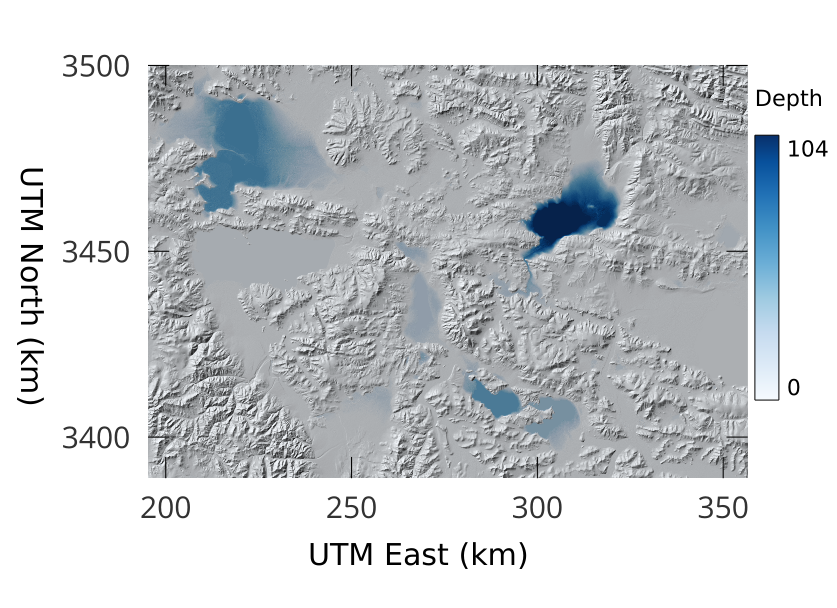

================================================
Building a command-line tool with libtopotoolbox
================================================

libtopotoolbox provides a set of functions for analyzing digital
elevation models. These functions operate on data passed in to them,
and they do not take care of memory management or reading data from
files. The bindings for libtopotoolbox in other languages such as
`Python <https://github.com/TopoToolbox/pytopotoolbox>`_ and `MATLAB <https://github.com/TopoToolbox/topotoolbox>`_ allow you to use the facilities of those languages
and their geospatial ecosystems to manage your data and pass it to
libtopotoolbox in the required format. 

In this tutorial, we will build a small command line application in C
that fills sinks in digital elevation models. We will use
libtopotoolbox's ``fillsinks`` function and `GDAL <https://gdal.org>`_ for data input and output.

Setting up the project
----------------------

The simplest way to build a C or C++ project using libtopotoolbox is
`CMake <https://cmake.org/>`_. We'll start by creating a new CMake project for our command
line application. If you would like more information on using CMake,
check out their `documentation <https://cmake.org/cmake/help/latest/index.html>`_, especially the `CMake Tutorial <https://cmake.org/cmake/help/latest/guide/tutorial/index.html>`_.

Create a new directory for the application. and then create the file
``CMakeLists.txt`` in that directory in a text editor.

Start that file by declaring a new project:

.. code:: cmake

    cmake_minimum_required(VERSION 3.14)

    project(
      fillsinks
      VERSION 0.0.1
      LANGUAGES C
    )

These lines define the minimum CMake version that we will support and
create a new project with the name ``fillsinks``.

We tell CMake to build an executable program called ``fillsinks`` by
adding the following at the end of our ``CMakeLists.txt``:

.. code:: cmake
    :name: cmake-executable

    add_executable(fillsinks fillsinks.c)

We tell CMake that the source code for our ``fillsinks`` program will be
in a file called ``fillsinks.c``. Create ``fillsinks.c`` in the same
directory as ``CMakeLists.txt`` and add a minimal ``main`` function.

.. code:: c

    int main(int argc, char *argv[]) {

      return 0;
    }

At this point, you should be able to build and run the program. From
the terminal in your source directory, run

::

    > cmake -B build
    > cmake --build build
    > build/fillsinks

``cmake -B build`` creates the CMake buildsystem for your operating
system and C compiler and stores everything it needs in the ``build/``
directory. The second line, ``cmake --build build`` runs the build
step. You should see some output that shows the ``fillsinks`` target
being built. The last line runs our program. Our program immediately
returns 0, so you shouldn't see anything at this point.

Before we start building our application, let's make sure that CMake
can find GDAL and libtopotoolbox. After the ``project`` lines but before
the ``add_executable`` in ``CMakeLists.txt``, add

.. code:: cmake
    :name: cmake-dependencies

    include(FindGDAL)

    include(FetchContent)
    FetchContent_Declare(
      topotoolbox
      GIT_REPOSITORY https://github.com/TopoToolbox/libtopotoolbox.git
      GIT_TAG main	      
    )
    FetchContent_MakeAvailable(topotoolbox)

``include(FindGDAL)`` uses the `FindGDAL <https://cmake.org/cmake/help/latest/module/FindGDAL.html>`_ CMake module to find the GDAL
library installed on your system. The following lines use `FetchContent <https://cmake.org/cmake/help/latest/module/FetchContent.html>`_
to download the latest version of libtopotoolbox from its GitHub
repository. Finally, we need to tell CMake to link GDAL and
libtopotoolbox to our executable. Finally, after the ``add_executable``
line, add

.. code:: cmake
    :name: cmake-link

    target_link_libraries(fillsinks GDAL::GDAL topotoolbox)

Now run the CMake build again

::

    > cmake -B build
    > cmake --build build

The first command should output something like ``Found GDAL`` to
indicate that it succesfully found GDAL on your system, and the second
should show that CMake builds the libtopotoolbox library alongside our
executable.

Reading data with GDAL
----------------------

Our command line program will read elevation data from a file using
GDAL. This section closely follows GDAL's `Raster API Tutorial <https://gdal.org/tutorials/raster_api_tut.html>`_.

Begin by including the GDAL header files and some necessary C
standard library headers at the top of ``fillsinks.c``.

.. code:: C

    #include <gdal.h>

    #include <stdlib.h>
    #include <stdio.h>
    #include <stddef.h>

Open a GDAL dataset from the filename passed on the command line
by adding the following code to the beginning of the ``main``
function.

.. code:: C

    if (argc != 2) {
      printf("Usage: fillsinks <filename>\n");
      return -1;
    }

    char *filename = argv[1];

    GDALAllRegister();

    GDALDatasetH hDataset = GDALOpen(filename, GA_ReadOnly);
    if (hDataset == NULL) {
      printf("Unable to open %s\n",filename);
      return -1;
    }

    GDALDriverH hDriver = GDALGetDatasetDriver(hDataset);

Now, continuing in ``main``, allocate an array to hold the DEM and read
the data from the file into that array.

.. code:: C

    ptrdiff_t xsize = GDALGetRasterXSize(hDataset);
    ptrdiff_t ysize = GDALGetRasterYSize(hDataset);

    float *dem = malloc(sizeof(*dem) * xsize * ysize);
    if (dem == NULL) {
      printf("Unable to allocate memory for DEM\n");
      GDALClose(hDataset);
      return -1;
    }

    GDALRasterBandH hBand = GDALGetRasterBand(hDataset,1);

    if (GDALRasterIO(hBand, GF_Read, 0, 0, xsize, ysize, dem, xsize, ysize,
                     GDT_Float32, 0, 0) != CE_None) {
      printf("Error reading from dataset\n");
      free(dem);
      GDALClose(hDataset);
      return -1;
    }

We have hardcoded band number 1 in ``GDALGetRasterBand``. The allocated DEM
is an array of single-precision floating point numbers, which is
required by libtopotoolbox's ``fillsinks`` function. ``GDALRasterIO``
automatically converts the data in the file to the correct data type
(``GDT_Float32``).

Filling sinks with libtopotoolbox
---------------------------------

To use libtopotoolbox in our code, we need to include the header file
at the top of ``fillsinks.c``.

.. code:: C

    #include <topotoolbox.h>

According to the header file and the libtopotoolbox API documentation,
``fillsinks`` has the following signature.

.. code:: C

    void fillsinks(float *output, float *dem, ptrdiff_t nrows, ptrdiff_t ncols);

``dem`` is a pointer to the input data, an array of size ``nrows * ncols``. ``nrows`` refers to the fastest changing dimension in the
two-dimensional array and ``ncols`` to the slowest changing
dimension. For data read by GDAL, this means that ``nrows`` corresponds
to the X dimension (``xsize``) and ``ncols`` corresponds to the Y
dimension (``ysize``).

The ``output`` array must be the same size as the input array, and we
must allocate it ourselves following our GDAL reading code in ``main``.

.. code:: C

    float *output = malloc(sizeof(*output)*xsize*ysize);

Following that, we have what we need to call ``fillsinks``:

.. code:: C

    fillsinks(output, dem, xsize, ysize);

The ``output`` array now contains the DEM with all of the sinks removed
using a grayscale morphological reconstruction algorithm.

Writing data with GDAL
----------------------

To write our the output data to a file, we'll use ``GDALCreateCopy`` to
create a new dataset with the same georeferencing information as the
input DEM and then write the ``output`` array. 

.. code:: C

    GDALDatasetH outDataset = GDALCreateCopy(hDriver, "filled_dem.tif", hDataset,
                                             FALSE, NULL, NULL, NULL);

    if (outDataset == NULL) {
      printf("Unable to create output dataset\n");
      free(output);
      free(dem);
      GDALClose(hDataset);
    }
    GDALRasterBandH outBand = GDALGetRasterBand(outDataset, 1);
    if (GDALRasterIO(outBand, GF_Write, 0, 0, xsize, ysize, output, xsize, ysize,
                     GDT_Float32, 0, 0 ) != CE_None) {
      printf("Unable to write output data\n");
    };

And finally we will free all of our resources including the GDAL
datasets. Closing the output dataset is necessary to ensure that the
data are properly written to the disk. Finish the ``main`` function with
the following, just before the ``return`` statement.

.. code:: C

    GDALClose(outDataset);
    GDALClose(hDataset);
    free(output);
    free(dem);

The complete code for both ``CMakeLists.txt`` and ``fillsinks.c`` can be
found below (`Complete code`_).

Compiling and running
---------------------

Since we haven't changed the build configuration, we don't need to run
the first configuration step (``cmake -B build``), but only the second,
compilation step

::

    > cmake --build build

We can now run our program on some data. Example DEMs can be found in
the `TopoToolbox/DEMs <https://github.com/TopoToolbox/DEMs>`_ repository.

::

    > build/fillsinks tibet.tif

There should now be a file called ``filled_dem.tif`` in your current
directory containing the sink-filled DEM.

    The difference between the filled Tibet DEM and the original, displayed over a hillshade of the original DEM.

Summary
-------

To incorporate libtopotoolbox into a project you should:

- Set up your compiler or build system so that it can find
  libtopotoolbox. CMake can help do this automatically.

- Include the header file ``topotoolbox.h``, which can be found in the
  ``include/`` directory of libtopotoolbox, in your C program.

- Load DEM data into your program using whichever methods you
  prefer. libtopotoolbox does not perform any input or output on its
  own.

- Allocate memory for all the necessary input, output and temporary
  data structures that the function requires. See the API
  documentation for details. libtopotoolbox does not allocate any
  memory.

- Call the desired libtopotoolbox functions.

  This procedure is roughly the same whether you are creating a simple
  command line application like we did here, integrating
  libtopotoolbox into a larger system like a GIS or creating new
  bindings for other programming languages.

Complete code
-------------

``CMakeLists.txt``

.. code:: cmake

    cmake_minimum_required(VERSION 3.14)

    project(
      fillsinks
      VERSION 0.0.1
      LANGUAGES C
    )

    include(FindGDAL)

    include(FetchContent)
    FetchContent_Declare(
      topotoolbox
      GIT_REPOSITORY https://github.com/TopoToolbox/libtopotoolbox.git
      GIT_TAG main	      
    )
    FetchContent_MakeAvailable(topotoolbox)

    add_executable(fillsinks fillsinks.c)
    target_link_libraries(fillsinks GDAL::GDAL topotoolbox)

``fillsinks.c``

.. code:: C

    #include <gdal.h>

    #include <stdlib.h>
    #include <stdio.h>
    #include <stddef.h>

    #include <topotoolbox.h>

    int main(int argc, char *argv[]) {

      if (argc != 2) {
        printf("Usage: fillsinks <filename>\n");
        return -1;
      }

      char *filename = argv[1];

      GDALAllRegister();

      GDALDatasetH hDataset = GDALOpen(filename, GA_ReadOnly);
      if (hDataset == NULL) {
        printf("Unable to open %s\n",filename);
        return -1;
      }

      GDALDriverH hDriver = GDALGetDatasetDriver(hDataset);

      ptrdiff_t xsize = GDALGetRasterXSize(hDataset);
      ptrdiff_t ysize = GDALGetRasterYSize(hDataset);

      float *dem = malloc(sizeof(*dem) * xsize * ysize);
      if (dem == NULL) {
        printf("Unable to allocate memory for DEM\n");
        GDALClose(hDataset);
        return -1;
      }

      GDALRasterBandH hBand = GDALGetRasterBand(hDataset,1);

      if (GDALRasterIO(hBand, GF_Read, 0, 0, xsize, ysize, dem, xsize, ysize,
                       GDT_Float32, 0, 0) != CE_None) {
        printf("Error reading from dataset\n");
        free(dem);
        GDALClose(hDataset);
        return -1;
      }

      float *output = malloc(sizeof(*output)*xsize*ysize);

      fillsinks(output, dem, xsize, ysize);

      GDALDatasetH outDataset = GDALCreateCopy(hDriver, "filled_dem.tif", hDataset,
                                               FALSE, NULL, NULL, NULL);

      if (outDataset == NULL) {
        printf("Unable to create output dataset\n");
        free(output);
        free(dem);
        GDALClose(hDataset);
      }
      GDALRasterBandH outBand = GDALGetRasterBand(outDataset, 1);
      if (GDALRasterIO(outBand, GF_Write, 0, 0, xsize, ysize, output, xsize, ysize,
                       GDT_Float32, 0, 0 ) != CE_None) {
        printf("Unable to write output data\n");
      };

      GDALClose(outDataset);
      GDALClose(hDataset);
      free(output);
      free(dem);

      return 0;
    }
